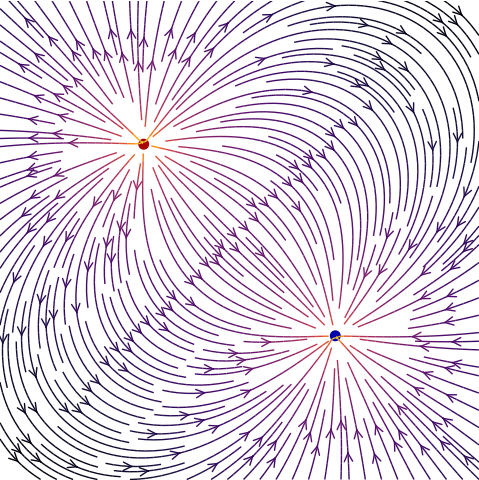
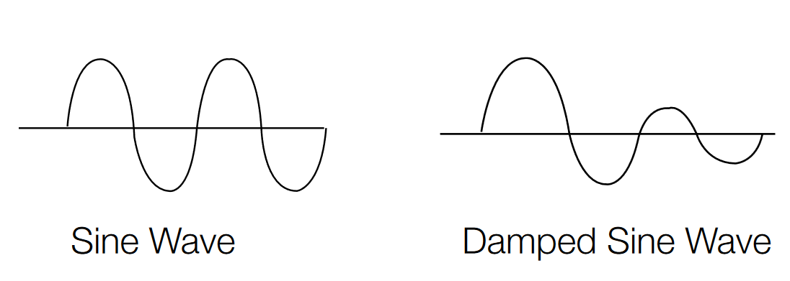

# Dataset Generator - mimics Tortuousity in Retinal Blood Vessels

This repository is a part of work done for: [Enhancing ROP Image Analysis through Synthetic Data and Attention Mechanisms](https://github.com/Mystic-Slice/Enhancing-ROP-Image-Analysis-through-Synthetic-Data-and-Attention-Mechanisms)

Tortuousity (irregular wavy pattern) in the retinal blood vessels is a sign of retinopathy. This generator can create a dataset of images that mimic the tortuousity in the retinal blood vessels. The dataset can be used to train a model to detect tortuousity in the retinal blood vessels. Even though the generated images don't perfectly match the pattern of retinal blood vessels, the general pattern is captured. Therefore, if a model can detect the tortuousity in the generated images, it is expected to detect the tortuousity in the retinal blood vessels as well.

## Random Walkers:

`Walker`s randomly choose and follow a path from the start point. They die when they hit the edge of the grid or when they reach their age (number of moves) limit. Each `Walker` can reproduce to create a child to produce the branching effect.

A `Walker` is set to be either tortuous or non-tortuous when created. If tortuous, they follow a damped sine curve to simulate the tortuousity. The children inherit the tortuousity of their parent.


## Movement of Walker:
The movement direction of a `Walker` is guided by a vector field. This is to give the vessel network the curved/converging pattern seen in the retinal blood vessels. There are two charges (positive - source - pushes away and negative - sink - pulls in). The walkers start at the source and move towards the sink. The direction of movement is also slightly guided towards the line connecting the source and the sink. This is a pattern seen in the retinal blood vessels. In order to retain some of the momentum from the previous steps, the movement direction also has its current movement direction as one of the components. There is also a little bit of randomness introduced by making a small deviation/turn from the current direction.

### Visualization of the vector field:


## Tortuous Movement:
The tortuous movement is simulated by a damped sine wave. The wavelength (& amplitude) of the sine wave is randomly chosen. 

### Damped Sine Wave:


## Sample Generated Images:

### Tortuous:
#### Tortuous Retinal Blood Vessels:

#### Tortuous Sample Generated (with bounding boxes around tortuous regions):


### Non-Tortuous:
#### Non-Tortuous Retinal Blood Vessels:

#### Non-Tortuous Sample Generated:


## Config Parameters:
Parameters that can be configured in the `config.py` file are:
1. `GRID_SIZE`: Size of the grid (image) in pixels.
2. `ANGLE_LOWER_BOUND`: Lower bound of the angle of the tortuous movement. (recommended: 15)
3. `ANGLE_UPPER_BOUND`: Upper bound of the angle of the tortuous movement. (recommended: 90)
4. `TORTUOUS_MOVEMENT_LENGTH_LIMITER`: Limit the length of a single step of a `Walker` when it is making a tortuous movement. Applied over `MOVEMENT_LENGTH_LIMIER`. (recommended: 0.3)
5. `TORTUOUS_PROBABILITY`: Probability of a `Walker` being a tortuous one. (recommended: 0.1)
6. `TORTUOUS_REPRODUCTION_PROBABILITY_MULTIPLIER`: Multiplier for the reproduction probability of a tortuous `Walker`. Recommended to be < 1 to prevent cluttering. (recommended: 0.75)
7. `MOVEMENT_LENGTH_LIMITER`: Limit the length of a single step of a `Walker`. As a percentage of the total grid size. (recommended: 0.05)
8. `NUM_WALKERS`: Number of `Walker`s to be generated.
9. `MAX_MOVES`: Maximum number of moves a `Walker` can take before dying. (recommended: 15)
10. `WALKER_CHILD_MAX_MOVES_MULTIPLIER`: Multiplier for the maximum number of moves of a `Walker`'s child. Recommended to be < 1 to avoid cluttering. (recommended: 0.5)
11. `WALKER_MATURITY_STEPS`: Number of steps a `Walker` has to take before it can reproduce. To prevent too many branches in the center.
12. `WALKER_INITIAL_REPRODUCTION_PROBABILITY`: Probability of a `Walker` reproducing when it is mature. (recommended: 0.6)
13. `WALKER_CHILD_REPRODUCTION_PROBABILITY_MULTIPLIER`: Multiplier for the reproduction probability of a `Walker`'s child. Should be decreasing to avoid population boom. (recommended: 0.1 (child 10 times less likely to reproduce))
14. `WALKER_INITIAL_PATH_WIDTH`: Initial width of the path of a `Walker` as a percentage of grid size. To simulate thickness. (recommended: 0.003)
15. `WALKER_PATH_WIDTH_DECAY`: Decay of the path width of a `Walker` as a percentage.(recommended: 0.01)
16. `WALKER_CHILD_PATH_WIDTH_MULTIPLIER`: Multiplier for the path width of a `Walker`'s child. (recommended: 0.5)
17. `VECTOR_FIELD_WEIGHT`: Weight of the direction of vector field when calculating direction of walker at each step. (recommended: 0.05)
18. `MIDDLE_LINE_WEIGHT`: Weight of the direction of the middle line when calculating direction of walker at each step. (recommended: 0.01)
19. `SINK_STRENGTH`: Strength of the sink compared to the source. Recommended to be > 1 to have the radial attraction effect on the walkers. (recommended: 10 (10 times as powerful as the source))

## How to use:

Install the required packages:
```sh
pip install -r requirements.txt
```

Code in `main.py` helps generate a dataset of images. The images are stored in a folder along with a csv file with filenames, tortuousity labels and the coordinates of bounding boxes for the tortuous regions.

### To generate sample image:
```py
img = generate_image(tortuous_image=True)
img.save("tortuous.png")
```

### Note:
This implementation is not perfectly abstracted. So, there are a few things that are not directly configurable from the `config.py` file. These settings have been set to work for my usecase. But, they can be changed in the code. Some of them are:
1. The grid size does not directly represent the number of pixels in the final image because of the cropping. 
2. There are a few parameters that are not in the config files (e.g. sine wave damping factor, "centered" point limits, etc...)
3. Each tortuous movement consists of 2 damped sine wave movement.
