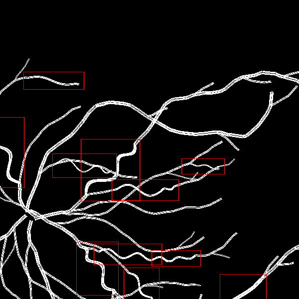

# Dataset Generator - mimics Tortuousity in Retinal Blood Vessels

`Walker`s randomly choose and follow a path from the start point until they hit the edge of the grid. They make a tortuous movement randomly with a small probability. 

The grid size (image size), the number of `Walker`s, the tortuousity probability and a few other parameters can be set in the `config.py` file.

## Sample Generated Images:

### Tortuous:


### Non-Tortuous:


## Config Parameters:
1. `GRID_SIZE`: Size of the grid (image) in pixels
2. `TORTUOUSITY_PROBABILITY`: Probability of a `Walker` making a tortuous movement (recommended: 0.001)
3. `ANGLE_LOWER_BOUND`: Lower bound of the angle of the tortuous movement (recommended: 15)
4. `ANGLE_UPPER_BOUND`: Upper bound of the angle of the tortuous movement (recommended: 135)
5. `NUM_WALKERS`: Number of `Walker`s to be generated
6. `MOVEMENT_LENGTH_LIMITER`: Limit the length of a single step of a `Walker`. As a percentage of the total grid size (recommended: 0.05)
7. `TORTUOUS_MOVEMENT_LENGTH_LIMITER`: Limit the length of a single step of a `Walker` when it is making a tortuous movement. Applied over `MOVEMENT_LENGTH_LIMIER` (recommended: 0.5)

## How to use:
Code in `main.py` helps generate a dataset of images. The images are stored in a folder along with a csv file with filenames and tortuousity labels.

### To generate sample image:
```py
img, is_tortuous = generate_image(draw_bounding_box=True)
img.save("sample.png")
print(f"Tortuosity: {is_tortuous}")
```