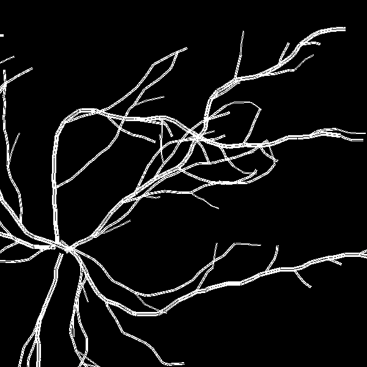

# Dataset Generator - mimics Tortuousity in Retinal Blood Vessels

`Walker`s randomly choose and follow a path from the start point. They die when they hit the edge of the grid or sometimes randomly based on a death probability that increased with their age. Each `Walker` can reproduce to create a child to produce the branching effect.

A `Walker` is set to be either tortuous or non-tortuous when created. If tortuous, they follow a damped sine curve to simulate the tortuousity. The children inherit the tortuousity of their parent.

This can be changed in the `config.py` file.

The grid size (image size), the number of `Walker`s and a few other parameters can be set in the `config.py` file.

## Sample Generated Images:

### Tortuous:
#### Tortuous Retinal Blood Vessels:

#### Tortuous Sample Generated:


### Non-Tortuous:
#### Non-Tortuous Retinal Blood Vessels:

#### Non-Tortuous Sample Generated:


## Config Parameters:
1. `GRID_SIZE`: Size of the grid (image) in pixels.
2. `ANGLE_LOWER_BOUND`: Lower bound of the angle of the tortuous movement. (recommended: 15)
3. `ANGLE_UPPER_BOUND`: Upper bound of the angle of the tortuous movement. (recommended: 90)
4. `MOVEMENT_LENGTH_LIMITER`: Limit the length of a single step of a `Walker`. As a percentage of the total grid size. (recommended: 0.05)
5. `TORTUOUS_MOVEMENT_LENGTH_LIMITER`: Limit the length of a single step of a `Walker` when it is making a tortuous movement. Applied over `MOVEMENT_LENGTH_LIMIER`. (recommended: 0.3)
6. `NUM_WALKERS`: Number of `Walker`s to be generated.
7. `WALKER_MATURITY_STEPS`: Number of steps a `Walker` has to take before it can reproduce. To prevent too many branches in the center.
8. `WALKER_INITIAL_REPRODUCTION_PROBABILITY`: Probability of a `Walker` reproducing when it is mature. (recommended: 0.6)
9. `WALKER_CHILD_REPRODUCTION_PROBABILITY_MULTIPLIER`: Multiplier for the reproduction probability of a `Walker`'s child. Should be decreasing to avoid population boom. (recommended: 0.1 (child 10 times less likely to reproduce))
10. `WALKER_INITIAL_DEATH_PROBABILITY`: Probability of a `Walker` dying when it is mature. (recommended: 0.05)
11. `WALKER_CHILD_DEATH_PROBABILITY_MULTIPLIER`: Multiplier for the death probability of a `Walker`'s child. Should be increasing to avoid population boom. (recommended: 2 (child twice as likely to die))
12. `WALKER_INITIAL_PATH_WIDTH`: Initial width of the path of a `Walker` as a percentage of grid size. To simulate thickness. (recommended: 0.005)
13. `WALKER_PATH_WIDTH_DECAY`: Decay of the path width of a `Walker` as a percentage.(recommended: 0.01)

## How to use:
Code in `main.py` helps generate a dataset of images. The images are stored in a folder along with a csv file with filenames and tortuousity labels.


### To generate sample image:
```py
img = generate_image(tortuous_image=True)
img.save("tortuous.png")
```